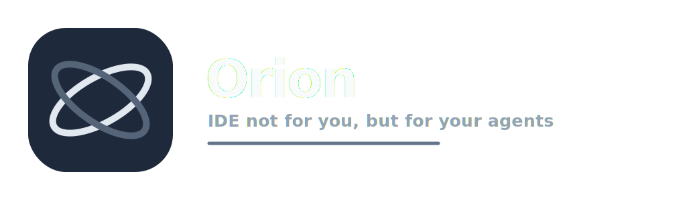

# Orion IDE



- Orion is a fast, lightweight, secure native desktop IDE for low-level languages and agent-driven code review.

Tagline:

```text
IDE not for you, but for your agents.
```

- Orion is designed for people who want a clean desktop app like modern IDEs, but without Electron, Chromium, a webview runtime, telemetry, heavy background services, or a built-in code runner output window. The main workflow is editing plus Git review, so agents and users can inspect changes quickly, mark files done, and keep moving.

## Status

- Orion is a GitHub-ready repository with source code, assets, installers, packaging templates, CI workflows, documentation, security notes, and contribution files.

## Design goals

- Run smoothly on very old hardware
- Start fast
- Use little memory
- Look clean and current
- Stay native, not browser-based
- Keep Git review first-class
- Avoid telemetry and hidden background network activity
- Avoid plugin execution by default
- Remember the last project folder until the user changes it
- Never copy a project into Orion's own folder

## Main features

- Native Rust desktop IDE using egui/eframe
- Modern minimal Orion logo and UI identity
- Persistent project folder memory
- Workspace explorer
- Multi-tab text editor
- C, C++, Rust, Zig, Assembly, and plain-text detection
- Lightweight syntax highlighting
- Low-power mode for older machines
- Built-in GUI Git review
- Changed-file list
- Stage and unstage selected file
- Commit staged changes
- GitHub-style side-by-side code difference view
- Done button for reviewed files
- Hide files marked Done
- Done files reappear when their change fingerprint changes
- Search and replace
- Command palette
- Settings window
- Safe file opening with size and binary checks
- No output panel for running code
- No telemetry
- MIT license

## Agent Git Review

- Orion replaces the usual run-output focused IDE workflow with an agent review workflow.

Open Git Review with:

```text
Ctrl-G
```

Git Review shows:

- Current repository
- Current branch
- Changed files
- Staged or unstaged status
- Side-by-side before and after diff
- Stage selected
- Unstage selected
- Done
- Not done
- Commit staged changes

The Done button works like a review completion marker. When a file is marked Done, Orion hides it from the changed-file list while Hide done is enabled. Orion stores only the repo path, file path, and change fingerprint in settings. It does not copy source files into Orion's config folder.

If the same file changes again, its fingerprint changes and it can appear again for review.

## Why no output window

Orion is intentionally not centered on running code in a terminal panel. It is centered on editing and reviewing changes for agent workflows.

If you need to run tests or programs, use your normal terminal, task runner, or CI. Orion stays light by not acting as a terminal multiplexer, build console, or long-running process supervisor.

## Lightweight design

Orion is built to run smoothly on very old hardware:

- Native Rust executable
- No Electron, Chromium, Node.js, or webview runtime
- No always-on language server
- No plugin host by default
- No telemetry service
- No built-in code runner output panel
- Workspace scanner skips generated folders
- Git commands run only when requested
- Syntax highlighter avoids per-frame keyword-set allocation
- Low-power mode disables heavier editor visuals
- Optional no-default-features build for the smallest dependency set

## Install with one command

These commands install from the GitHub repository. If you publish this repo under your own account, update the repository URL inside `scripts/install.sh` and `scripts/install.ps1`, or pass `ORION_REPO_URL` as an environment variable.

Windows PowerShell:

```powershell
iwr -useb https://raw.githubusercontent.com/Chintanpatel24/orion/main/scripts/install.ps1 | iex
```

Linux and macOS:

```sh
curl -fsSL https://raw.githubusercontent.com/Chintanpatel24/orion/main/scripts/install.sh | sh
```

Local source install:

Windows PowerShell:

```powershell
powershell -NoProfile -ExecutionPolicy Bypass -File .\install.ps1
```

Linux and macOS:

```sh
sh ./install.sh
```

## Requirements

Required:

- Rust toolchain with Cargo
- Git installed and available in PATH
- Git if using the one-line GitHub installer

Install Rust from:

```text
https://rustup.rs
```

Linux may also need system packages for native windows and OpenGL. On Debian or Ubuntu based systems:

```sh
sudo apt install build-essential pkg-config libx11-dev libxi-dev libgl1-mesa-dev libasound2-dev libgtk-3-dev
```

## Run

After installation:

```sh
orion
```

Open a project folder from the command line:

```sh
orion /path/to/project
```

From source:

```sh
cargo run
```

Build a tuned binary:

```sh
cargo build --release
```

Build the smaller tuned profile:

```sh
cargo build --profile release-small
```

Build the lightest desktop binary without native file-dialog dependencies:

```sh
cargo build --release --no-default-features
```

or:

```sh
make lite
```

In no-default-features mode, open files and folders through the command palette using `open <path>` and `folder <path>`.

## Shortcuts

| Shortcut | Action |
| --- | --- |
| `Ctrl-N` | New file |
| `Ctrl-O` | Open file |
| `Ctrl-Shift-O` | Open project folder |
| `Ctrl-S` | Save |
| `Ctrl-Shift-S` | Save as |
| `Ctrl-P` | Command palette |
| `Ctrl-F` | Search |
| `Ctrl-G` | Git Review |
| `Ctrl-Q` | Quit |

On macOS, use the Command key where the system maps it as the command modifier.

## Command palette

Open the command palette with `Ctrl-P`.

Built-in actions include:

- New file
- Open file
- Open folder
- Save
- Save as
- Save all
- Git review
- Refresh Git
- Search
- Refresh workspace
- Settings
- Help

Freeform commands:

```text
open path/to/file.c
folder path/to/project
git
review
```

## Repository structure

```text
.
  src/                    Rust desktop IDE source
  scripts/                Install and release scripts
  docs/                   User, architecture, security, and performance docs
  packaging/              Linux, Windows, and macOS packaging templates
  assets/                 Logos, icon, and preview assets
  .github/workflows/      GitHub Actions CI, security, and release workflows
  Cargo.toml              Rust package manifest
  Makefile                Common developer commands
  README.md               Main project documentation
  LICENSE                 MIT license
```

## Development

Run checks:

```sh
cargo fmt --all -- --check
cargo clippy --all-targets --all-features -- -D warnings
cargo test --all-features
```

Run the app:

```sh
cargo run
```

Build release:

```sh
cargo build --release
```
